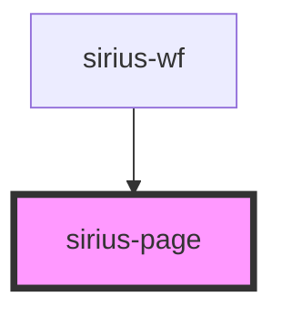

# sirius-page

<!-- Auto Generated Below -->

## Properties

| Property       | Attribute | Description | Type           | Default     |
| -------------- | --------- | ----------- | -------------- | ----------- |
| `modelService` | --        |             | `ModelService` | `undefined` |
| `page`         | --        |             | `Page`         | `undefined` |

## Dependencies

### Used by

 - [sirius-wf](../sirius-wf)

### Graph

----------------------------------------------

*Built with [StencilJS](https://stenciljs.com/)*
