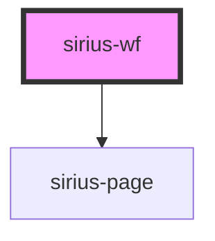

# app-root

<!-- Auto Generated Below -->

## Properties

| Property  | Attribute  | Description | Type     | Default     |
| --------- | ---------- | ----------- | -------- | ----------- |
| `apiKey`  | `api-key`  |             | `string` | `undefined` |
| `baseUrl` | `base-url` |             | `string` | `undefined` |
| `process` | `process`  |             | `string` | `undefined` |

## Events

| Event       | Description | Type               |
| ----------- | ----------- | ------------------ |
| `wfMessage` |             | `CustomEvent<any>` |

## Methods

### `addActivity(type: string, create: any) => Promise<void>`

#### Returns

Type: `Promise<void>`

### `dehydrate(sessionId: string) => Promise<void>`

#### Returns

Type: `Promise<void>`

### `goto(activity: string) => Promise<void>`

#### Returns

Type: `Promise<void>`

### `hydrate(process: string, sessionId: string, activity?: string) => Promise<void>`

#### Returns

Type: `Promise<void>`

### `load(processDef: string | object, activity?: string) => Promise<void>`

#### Returns

Type: `Promise<void>`

### `loadProcess(process: Process, activity?: string) => Promise<void>`

#### Returns

Type: `Promise<void>`

### `loadUrl(process: string, activity?: string) => Promise<void>`

#### Returns

Type: `Promise<void>`

### `parse(processDef: string) => Promise<Process>`

#### Returns

Type: `Promise<Process>`

## Dependencies

### Depends on

- [sirius-page](../sirius-page)

### Graph

----------------------------------------------

*Built with [StencilJS](https://stenciljs.com/)*
