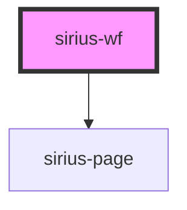

# app-root

<!-- Auto Generated Below -->

## Events

| Event     | Description | Type               |
| --------- | ----------- | ------------------ |
| `wfError` |             | `CustomEvent<any>` |

## Methods

### `addActivity(type: string, create: any) => Promise<void>`

#### Returns

Type: `Promise<void>`

### `goto(activity: string) => Promise<void>`

#### Returns

Type: `Promise<void>`

### `loadProcess(process: Process) => Promise<void>`

#### Returns

Type: `Promise<void>`

### `parse(processDef: string) => Promise<Process>`

#### Returns

Type: `Promise<Process>`

## Dependencies

### Depends on

- [sirius-page](../sirius-page)

### Graph

----------------------------------------------

*Built with [StencilJS](https://stenciljs.com/)*
